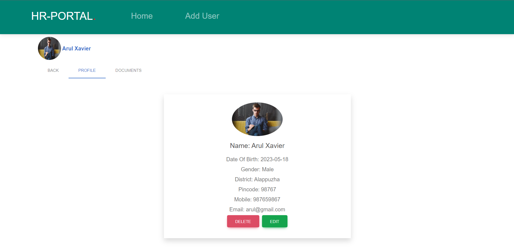
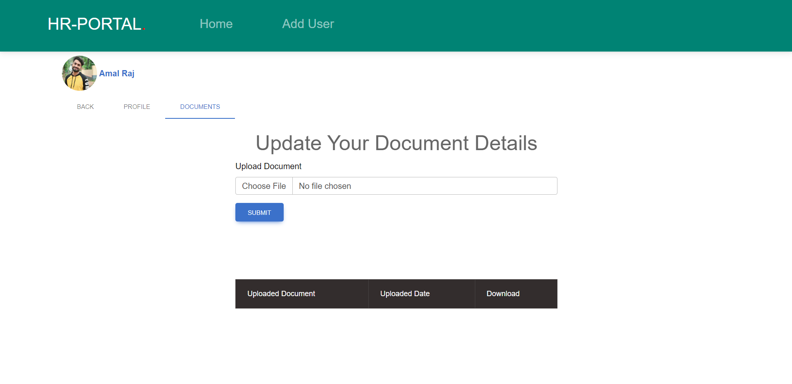
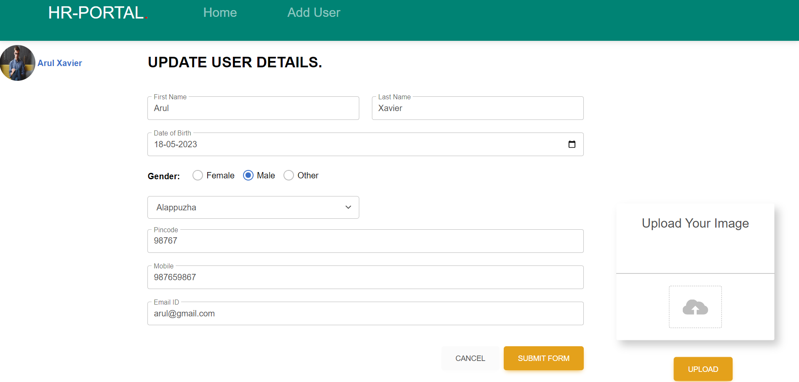
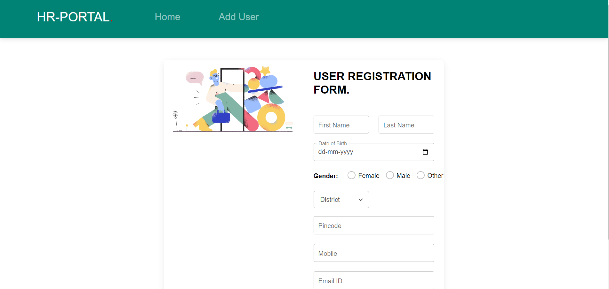

# HR

## Installation

1. Clone the repository:

```bash 
https://github.com/rahul-rajendaran/HR_PORTAL.git
````
2. Change to the project directory and Install dependencies

```
cd backend 
npm install

```

```
cd client
npm install
```

## Screenshots

Home page


<br>

homepage continuation


<br>

Single view page


<br>

Document page


<br>

Edit page


<br>

Add page
